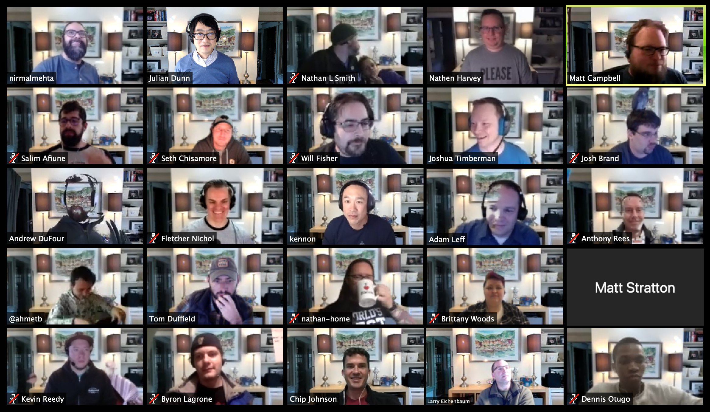

# Conference Call Backgrounds

Use these images for backgrounds in your next conference call.

Contribute your own via PR.

All images must be released to the public domain.

  
   
  To the extent possible under law,
  <a rel="dct:publisher"
     href="https://github.com/nathenharvey/zoom-backgrounds">
    Nathen Harvey</a>
  has waived all copyright and related or neighboring rights to
  Conference Call Backgrounds.
This work is published from:

  United States.

# Distributed Happy Hour

Our next distributed happy hour will be held soon.  All attendees must abide by the following rules:

1.  **Bring your own beverage** of choice; no beverages will be provided as part of this happy hour, please bring your own beverage of choice ;)
2.  You must **consent to screen shots** of the happy hour being **posted online**.
3.  You must **follow our [Code of Conduct](https://github.com/nathenharvey/conference-call-backgrounds/blob/master/CONDUCT.md)**; we are dedicated to providing a harassment-free experience for everyone.

Attendees are encouraged to **use one of the backgrounds** from [this repository](https://github.com/nathenharvey/conference-call-backgrounds).  It is OK if you do not have a green screen and the rendering is less than optimal, in fact, that might make the event even more fun for everyone!

## Want to attend?

Interested in joining our next remote-firendly happy hour?

Send a DM to [@nathenharvey](https://twitter.com/nathenharvey) asking to be added to the next calendar invite.

OR 

Email [Nathen Harvey](mailto:nathen.harvey@gmail.com?Subject=Distributed-Happy-Hour) asking for a calendar invite with details of the event.

# Examples

Want to see these backgrounds in action?

* https://twitter.com/julian_dunn/status/1179091370671251456
* https://twitter.com/olearycrew/status/1179132978041098240
* https://twitter.com/AnthonyRees/status/1179644356950519808
* https://twitter.com/iambillmeyer/status/1179142071975759873
* https://twitter.com/jtimberman/status/1191419181687685120
* https://twitter.com/apporima/status/1192540414856835072

Add your own examples via a PR to this repository or by tagging [@nathenharvey](https://twitter.com/nathenharvey) in your tweet.

## Past Happy Hours

### 2020-03-19

### 2020-03-10

We had a great time discussing new work from home policies during our second happy hour.

### 2019-11-14

Our first remote-friendly, virtual background, distributed happy hour was a success!  Thank you to everyone who joined us.

